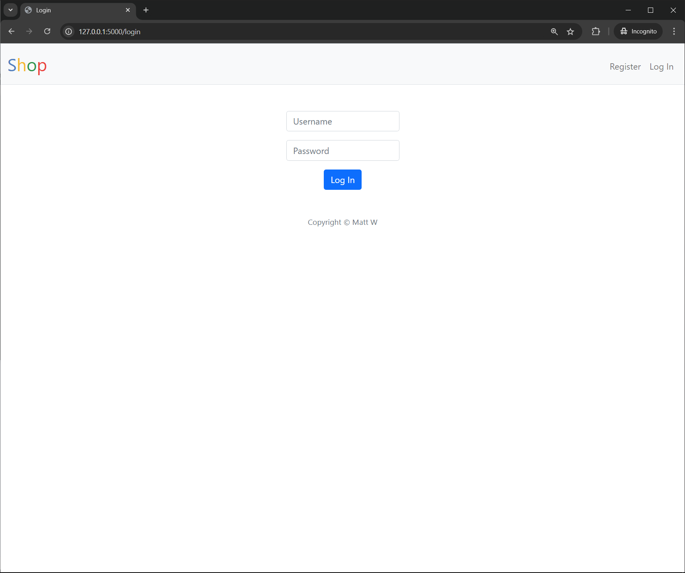
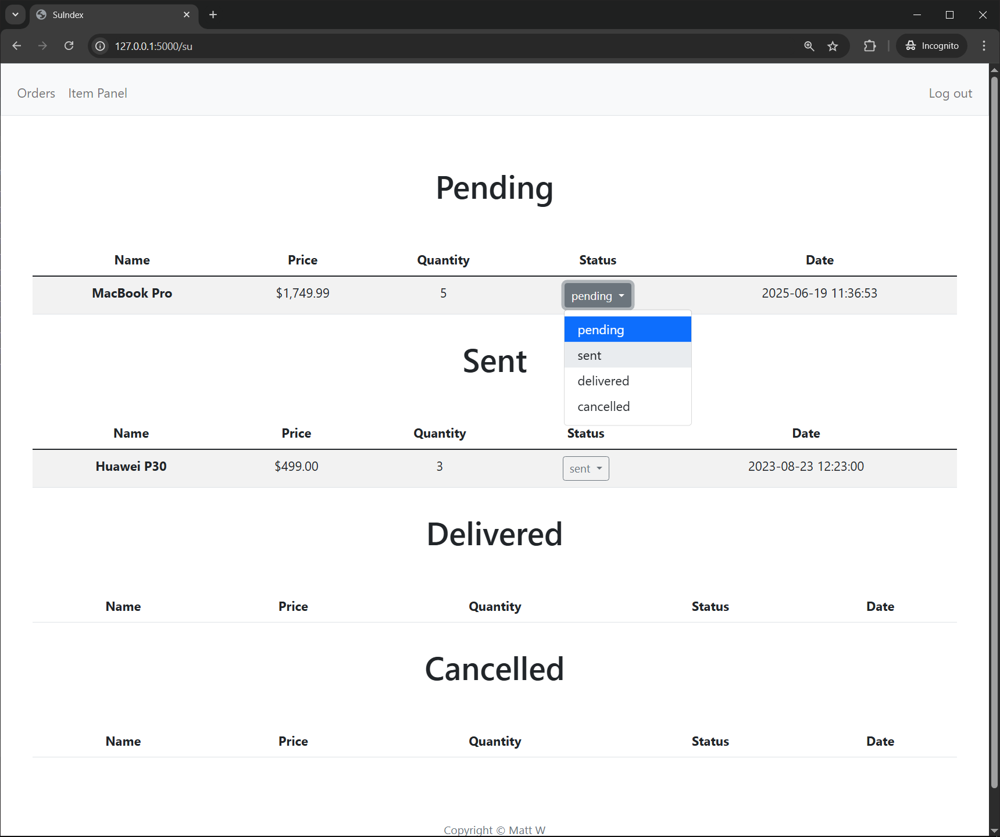

# Online Shop

> See a remake of this project that uses SQLite3 instead of CS50.SQL: https://github.com/Matt1479/Online-Shop-Remake

#### Video Demo: https://youtu.be/qeWnnzCsNBA

#### Description
Welcome! This project is a web store, it's written in Python using the Flask framework. It allows users to create an account, purchase various items, view their orders and more. I hope you'll like it!

#### Getting Started - Installation
- Clone this repository: `git clone https://github.com/Matt1479/Online-Shop`
- Install dependencies by running  `pip install -r requirements.txt`

#### How to use this Project
- Run the application using: `flask run`
- Click on the link provided by the CLI. You should be welcomed by the login page.
- Feel free to create an account, buy some items, view your orders, etc.
    - If you'd like to use the admin panel, navigate to `/su` , you should be welcomed by the superuser login page.
        - The credentials are as follows:
            - login: `testsu`
            - password: `cs50`
        - In there you can view orders made by users, see the item panel, etc.

#### Features
- User panel:
    1. Login and Register.  
      
      
    2. Change user's password.  
      
    3. View available items to buy.  
      
    4. Search for an item through a search bar.  
      
    5. View an item, change item's quantity, add to cart.  
      
      
      
    6. View cart, change item's quantity in cart, delete an item from cart, checkout/buy all items in a cart.  
      
      
      
      
      
      
    7. View user's orders (name, price, quantity, status, date)  
      

- Admin panel:
    1. View orders and change their respective statuses (pending, sent, delivered, or cancelled).  
      
      
      
      
    2. View, Edit, or Delete items that are available to buy in the shop.  
      
      
      
      
    3. Add new items to the shop.  
      
      
    4. 404 page.  
      

#### Technologies used:
- Python
- Flask
- Jinja
- sqlite3
- HTML, CSS, JavaScript, AJAX
- Bootstrap
- And other small modules (libraries)

#### References
- [Python3 documentation](https://www.python.org/)
- [Flask documentation](https://flask.palletsprojects.com/en/2.3.x/)
- [Boostrap documentation](https://getbootstrap.com/)

#### License
This project is licensed under MIT license. See <a href="./LICENSE.md">LICENSE</a> file for more information.
